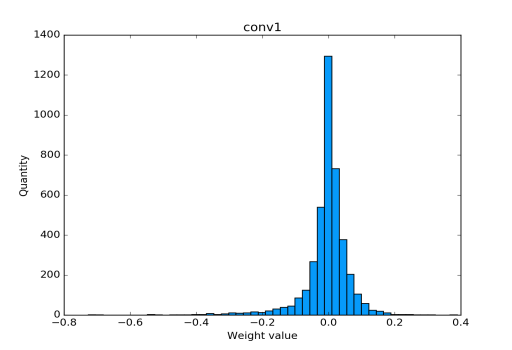
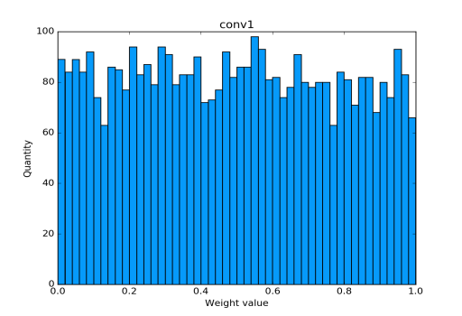
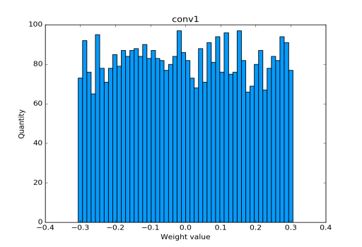

# Package that helps you to gain insights about your deep learning models. 

## Currently implemented tools:</br>
1. ### SingleLayerVisualizer </br>
<br>
<br>

### `SingleLayerVisualizer` example
You can find full runnable example in [single_layer_visualizer_example.py](examples/single_layer_visualizer_example.py)

Consider following example

```python
import cv2
import torch
from torchvision.models import resnet50

from pytorch_debug_tools.SingleLayerVisualizer import SingleLayerVisualizer
from pytorch_debug_tools.utils.Resolution import Resolution

# load resnet50 pretrain
pretrain = resnet50(pretrained=True)
# get first conv layer from it
first_conv = pretrain.layer1._modules['0'].conv1
# create visualizer
visualizer = SingleLayerVisualizer(Resolution(height=350, width=512))
hist_from_pretrained_conv = visualizer.visualize(weight=first_conv.weight.detach().numpy(),
                                                 name='conv1', num_bins=50)
cv2.imwrite('pretrained_conv.png', hist_from_pretrained_conv)
```
Now you can open `pretrained_conv.png` and see following
<br>

<br>
We can reinitialize convolution weight and visualize it again
```python
# reinitialize conv weight with random uniform
torch.nn.init.uniform_(first_conv.weight)
hist_from_uniform_init = visualizer.visualize(weight=first_conv.weight.detach().numpy(),
                                              name='conv1', num_bins=50)
cv2.imwrite('random_uniform_weight.png', hist_from_uniform_init)
```
Now you can open `random_uniform_weight.png` and see following 
<br>

<br>
Or we can reinitialize convolution weight with more popular initialization like kaiming uniform.
```python
# reinitialize conv weight with random uniform
torch.nn.init.kaiming_uniform_(first_conv.weight)
hist_from_kaiming_uniform_init = visualizer.visualize(weight=first_conv.weight.detach().numpy(),
                                              name='conv1', num_bins=50)
cv2.imwrite('kaiming_uniform_weight.png', hist_from_kaiming_uniform_init)
```
Now you can open `kaiming_uniform_weight.png` and see following 
<br>

<br>
<br>

#### So if you are running training from scratch, then you should see how your layer weights are transforming from random init distribution(histogram) to something that looks like distribution(histogram) in `pretrained_conv.png` file.